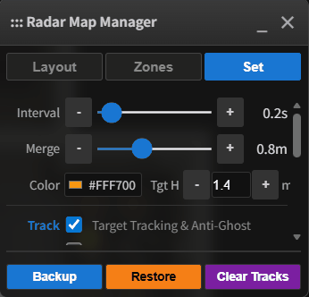

# Radar Map Manager (RMM)


[](https://github.com/hacs/integration)

> 🇺🇸 English Documentation | 🇨🇳 [中文文档](README_zh.md)

**Radar Map Manager (RMM)** is a millimeter-wave radar visualization and data fusion integration built specifically for Home Assistant.

It is not just a floor plan card, but a **spatial perception engine**. RMM maps data from multiple scattered millimeter-wave radars in your home onto one or more floor plans, enabling whole-house human tracking, trajectory visualization, and precise coordinate-based automation.

> 🚀 V1.2 Major Upgrade! Bringing epic evolutions in performance and security! Introducing the new 10Hz In-Memory Streaming Bus (Zero I/O) to completely eliminate database bloat; adding a Zero-Trust Security Architecture; supporting Hardware-Level Polygon Zone synchronization for RMM Exclusive Radars (upcoming); and adding Entrance Zones and Stationary Hold Zones as multiple fail-safes to prevent false triggers and disappearing stationary targets.

---

## ✨ Core Features

### 1. 🎯 WYSIWYG Visual Editor
Ditch the tedious YAML coordinate calculations! RMM provides an interactive frontend editor:
* **Config/View Modes**: Supports **Config Mode** and **Read-Only Mode**, allowing for both easy setup and clean display.
* **Auto Discovery**: Automatically scans and easily adds supported radar devices within the local network.
* **Multi-Map/Multi-Floor Support**: Manage multiple floors and locations easily with **`map_group`**, creating independent views for your home or office.
* **Flexible Radar Configuration**: Drag and drop radar positions directly on the floor plan. Supports rotation, scaling, and mirroring for one-stop management.
* **Automatic Positioning & Scaling**: With the **Freeze** function, you can visually locate a radar target relative to the floor plan to easily adjust the radar scaling—goodbye to blind guessing.
* **Mounting Styles**: Perfectly supports both **Side Mount** and **Ceiling Mount** radars.

### 2. 🌐 Multi-Radar Sensor Fusion
RMM's target fusion engine unifies target points from multiple radars into a single coordinate system:
* **Auto-Clustering**: Merges data when multiple radars detect the same person to prevent "ghost targets." Supports custom fusion ranges.
* **Blind Spot Compensation**: Eliminates detection dead zones in rooms by overlapping multiple radars.
* **Trajectory Smoothing**: Built-in 10-level target trajectory smoothing to eliminate stuttering and jumping.

### 3. 🛡️ Flexible Zone Management
Supports arbitrary polygons with flexible editing, making zone management easy:
* **Radar Monitor Zones**: Set individual monitor zones for each radar. Targets are only fused and displayed if they enter this zone; otherwise, global fusion is used by default.
* **Global Detect Zones**: **Automation Powerhouse!** Freely set detection zones on the floor plan. When a fused target enters these zones, HA entities (automatically generated) are triggered. You can also customize trigger delays to avoid false alarms.
* **Global Exclude Zones**: **The False Alarm Killer!** Draw zones around fans, curtains, or plants. The engine automatically filters out all interference signals within these areas.
* **Entrance Zones**: **Green Channel & Double Insurance against False Alarms!** Any new target spawned within this zone is unconditionally trusted and verified instantly, bypassing the verify delay to achieve zero-latency "occupied" reporting.
  * *Tip: It is highly recommended to draw this zone at the actual door frames of your room.*
* **Stationary Hold Zones**: **The Ultimate Defense against "Lights Out While Occupied".** Designed for scenarios with extreme stillness like deep sleep, reading, or using the bathroom. If the radar temporarily loses your signal within this zone, the system locks a "Stationary Anchor" in place, continuing to report "occupied" until the countdown finishes.
* **Independent Delay (`Dly`)**: Customize the tolerance time (in seconds) for each piece of furniture. Simply enter the seconds in the top `Dly` input when drawing (leave blank or set to 0 to fall back to the global `S_Hold` time).
  * *Bed (Deep Sleep)*: Set to `3600` (1 hour). Sleep soundly till morning even if motionless under thick blankets.
  * *Sofa (Focused Viewing)*: Set to `600` (10 mins). Perfectly balances an immersive experience with energy-saving auto-off when you leave.
  * *Toilet/Bathtub (Bathroom)*: Set to `300` (5 mins). Say goodbye to the awkward hand-waving needed to keep the lights on.
* **Hardware-Level Zones (`Hardware Zones`)**: (Exclusive for RMM Exclusive Radars, upcoming) Draw polygons on the HA map and sync them directly to the radar's hardware for native signal filtering! This perfectly complements global zones.
* **Automation Entities**: Each Global Detect Zone automatically generates a **Presence entity (`binary_sensor`)** and a **Count entity (`sensor`)**, letting you easily implement automations. Easily implement automations like "Person on sofa automatically turns on TV" or "Person enters bathroom area automatically adjusts lights."

### 4. 📐 3D Spatial Correction
For side-mounted radars, RMM features a built-in 3D geometric correction algorithm. It automatically converts Slant Range to Ground Distance based on installation height and target height, significantly improving positioning accuracy.

---

## 🛠️ Supported Hardware

RMM is compatible with any millimeter-wave radar integrated into Home Assistant (including 1D, 2D, and 3D variants), as long as they provide `DISTANCE` or `X/Y` coordinate data, such as `HLK-LD2450` `LD2460` `LD6001` `LD6002b` `LD6004`.

### Connection Methods
* **RMM Exclusive Firmware** *(Upcoming, stay tuned)*
* **ESPHome / MQTT** *(Recommended for open-source users)*
* **Zigbee** *(Must support coordinate reporting)*

### ⚠️ IMPORTANT NOTICE!!!

#### Coordinate Entity Naming Convention (Non-RMM Exclusive Radars)
To ensure the integration correctly parses radar data, please adhere to the following entity naming conventions:

1. **1D Radar**: `sensor.[radar_name]_distance`
   * *Example: `sensor.rd_ld2410_distance`*
2. **2D/3D Radar**: `sensor.[radar_name]_target_?_x`
   * *Must include `_x`, `_y`, and optionally `_z` variants.*
   * *Example: `sensor.rd_ld6004_target_1_x`*
3. **Radar Target Count [Optional]**: `sensor.[radar_name]_presence_target_count`
   * *Example: `sensor.rd_ld2450_presence_target_count`*
4. **Target Coordinate Units**:
   * *Supported units: `m`, `cm`, `mm`*
   * *Highly recommended to define the unit. If omitted, `m` (meters) is assumed by default.*

#### Database Optimization (Recorder Exclusion)

**For V1.0.x Users (Strongly Recommended)**:
If you are running **RMM V1.0.x**, we strongly advise adding the following to your `configuration.yaml` to minimize database bloat and disk I/O:

```yaml
recorder:
  exclude:
    entity_globs:
      - sensor.rmm_*_master  # Excludes high-frequency coordinate attributes
```

---

## 📦 Installation

### Method 1: HACS Automatic Installation (Recommended)
[](https://my.home-assistant.io/redirect/hacs_repository/?owner=Moe8383&repository=radar_map_manager&category=integration)
1. Open **HACS** in your Home Assistant.
2. Go to **Integrations** and click the **Explore & Download Repositories** button at the bottom right.
3. Search for **"Radar Map Manager"** and click **Download**.
4. Click to view the details, and click **Download** in the bottom right corner.
5. Restart your Home Assistant.

### Method 2: Manual Installation
1.  Download the `custom_components/radar_map_manager` folder from this repository.
2.  Copy it to your Home Assistant's `custom_components/` directory.
3.  Restart Home Assistant.

---

## ⚙️ Configuration Guide

### Step 1: Add Integration
1.  Go to **Settings** -> **Devices & Services** -> **Add Integration**.
2.  Search for **Radar Map Manager** and add it.

### Step 2: Add Card
1.  On your dashboard, click "Edit Dashboard" -> "Add Card".
2.  Search for the **Radar Map Manager** card.
3.  Or use the following YAML configuration:

**Standalone Use (Manual Card):**
```yaml
type: custom:radar-map-card
map_group: default                   # Optional, floor plan/map group name, default: default
read_only: false                     # Optional, true for view mode, false for edit mode, default: false
bg_image: /local/floorplan/house.png # Required in edit mode, path to floor plan image
target_radius: 5                     # Optional, size of the fused target dot
handle_radius: 1.5                   # Optional, size of edit handles
handle_stroke: 0.2                   # Optional, border size of active handles
zone_stroke: 0.5                     # Optional, zone line width
label_size: 2                        # Optional, font size for zone names
target_colors:                       # Optional, custom colors for raw radar targets
  - yellow
  - "#00FFFF"
  - "#FF00FF"
```

**Use inside a Picture-Elements Card:**
```yaml
type: picture-elements
image: /local/floorplan/3dplan/blank_floor.png
elements:
  - type: custom:radar-map-card
    target_radius: 5
    read_only: true
    style:
      top: 50%
      left: 50%
      width: 100%
      height: 100%
      transform: translate(-50%, -50%)
      pointer-events: none
```

---

## 🪄 Editor Mode Guide

Click the ⚙️ icon in the top right corner of the card to enter Edit Mode.


### A. 📡 Radar Layout (Layout)

Click `Layout` in the panel to enter radar layout mode. Targets displayed here are raw radar coordinates.


#### 1. Add/Delete Radar

* Add: Click `+`, enter the radar name as defined in HA. For example, if the coordinate entity is `sensor.rd_ld2450_target_1_x`, enter: `rd_ld2450`

* Delete: Select an added radar and click `-` to delete it. Operate with caution.

#### 2. Radar Settings


* Positioning: Drag the radar to its actual physical location on the map. Drag the radar handle to adjust the angle. Position and rotation can be fine-tuned using the `X`/`Y`/`Rot` inputs in the panel.

* Scale Adjustment: Stand within the radar's detection range (preferably away from the center line and try multiple positions). Use a combination of these methods to match radar targets with the floor plan:
  
  * 1（Recommended). Click the `Freeze` button. This locks the first target detected by the radar. Manually drag this target to your actual standing position on the floor plan, and the system will automatically calculate the scale.


  * 2. Adjust `ScX` and `ScY` sliders to change the `X`/`Y` coordinate scaling.
  * 3. Click `Ax` / `Ay` to automatically adjust based on the background image aspect ratio (reference only).
  

* Mounting Mode: Check `Ceiling` at the bottom of the panel to switch between "Side Mount" and "Ceiling Mount".

* Mirror Mode: Check `Mirror` to invert the radar's X-axis.

* 3D Correction: Check `3D` and input the radar installation `height` (in meters) to enable 3D geometric correction. If the radar height is within standard ranges, this may not be necessary.

* UNDO: Undo the last operation.

#### 3. Radar Monitor Zones


* Select a radar via the panel or the map, then click the `Monitor` button to edit its monitor zones.

* Add Zone: Click `ADD NEW`, define the shape by clicking polygon points on the map, name the zone, and click `FINISH` to save.

* Adjust Zone: Select a zone and drag points to adjust the shape. Double-click a point to delete it.

* Delete Zone: Select a zone and click `DEL` to remove it; click `CLR ALL` to remove all monitor zones for that radar (Caution!).

* Click `DONE` to exit Monitor zone editing.

### B. 🛡️ Zone Management (Zones)

Click `Zones` in the panel to enter global zone management. Note: Zones here are global and relate only to fused targets, not specific radars. Targets displayed here are fused coordinates (default gold color).


#### 1. Detect Trigger Zones

* Editing operations are the same as Monitor zones.

* Delay: Supports setting a target entry delay. Enter the delay time (in seconds) in the `Dly` box to prevent false alarms caused by transient anomalies.

* Automation: Once set, this automatically creates "Occupancy" and "Count" entities for automation.


#### 2. Detect Exclude Zones


* Editing operations are the same as Monitor zones.

* Purpose: Fused targets falling into this zone will not be displayed or triggered. Use this to mask interference from fans, air conditioners, etc.

#### 3. Entrance Zones


* Editing operations are the same as Monitor zones.

* Purpose: Fused targets falling into this zone are immediately granted "Verified" status, bypassing the `verify` delay.

#### 4. Stationary Hold


* Editing operations are the same as Monitor zones.

* Individual occupancy tolerance duration can be defined via the `Dly` setting (unit: seconds). Leave blank or set to 0 to use the global `S_Hold` time by default.

* Purpose: When a radar temporarily loses a signal within this zone due to absolute target stillness, the system locks a "Stationary Anchor" in place, continuing to report "occupied" to the smart home until the countdown expires.

### C. ⚙️ Settings (Set)

Click `Set` in the panel for global parameters.



* `Interval`: Backend polling and calculation refresh interval (in seconds).
* `Merge`: Radar target fusion distance (in meters). Targets from different radars within this distance will be merged into one.

* `Color`: Custom color for fused targets.
* `Tgt_H`: Target centroid height, used for 3D correction.

* `Track`: When enabled, activates the advanced anti-ghosting and kinematic tracking engine; when disabled, it falls back to a simple stateless passthrough mode.
* `Labels`: When enabled, displays tracking IDs (1, 2, 3...) directly on the solid target dots on the map.
* `Smooth`: Smoothness level of the target movement trajectory (Levels 1-10).
* `Verify` (Verification Delay & Rules): Dual-track verification engine.
  * **Checked (Standard Mode)**: Allows targets to spawn anywhere in the room, but they must pass the set observation period (seconds) to become verified, effectively filtering out random noise.
  * **Unchecked (Strict Entrance Mode)**: Enables an absolute veto! Only targets entering through the "Entrance Zone" are valid. The underlying engine silently purges interference from flying bugs or fans appearing out of nowhere.
* `Hbm_TTL` (Hibernation Time-To-Live): The duration (in hours) the system retains a "spatial snapshot" after a target temporarily disappears. Reappearing nearby instantly reactivates it with the original ID, ensuring tracking continuity. Recommended default: 12h.
* `S_Hold` (Global Stationary Hold): The default tolerance hold time (in seconds) for global stationary zones.
* `J_Base` (Base Spatial Tolerance): The physical limit (in meters) the system can tolerate for target point cloud jitter when stationary. Recommended range: 0.8 - 1.5 m.
* `J_Speed` (Max Movement Speed): Sets the fastest possible human movement speed indoors (in meters/second), forming an impenetrable "dynamic anti-teleportation barrier." Recommended range: 2 - 3 m/s.
* `Backup` / `Restore`: Export or import JSON configuration files for easy backup and migration.
* `Clear Tracks`: Clears the tracking history and target IDs on the current map.


## ❤️ Support the Project
If you find this project helpful, please give it a **⭐️ Star**！

[](https://www.buymeacoffee.com/moe8383)
[](https://afdian.com/a/moe8383)

* Bug Reports: Please submit an [Issue](https://github.com/Moe8383/radar_map_manager/issues)。

License: MIT
